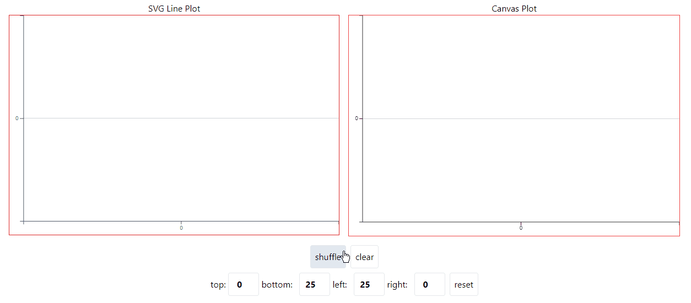

# D3.js with React



This is an basic example to demonstrate how to use `d3.js`(Data-Driven Document)
with React Framework using hooks. Also, showing how to plot the same figure with
canvas.

## Using d3.js with react hooks

### Create simple chart with `React.useRef` and `React.useEffect`

```typescript
import * as d3 from "d3";
import { useRef } from "react";

const LinePlot = () => {
  const ref = useRef<SVGSVGElement>(null);

  // d3 select ref
  var svg = d3.select(ref.current);
  // create simple rect
  svg
    .append("rect")
    .attr("fill", "steelblue")
    .attr("width", 100)
    .attr("height", 100)
    .attr("x", 10)
    .attr("y", 10);

  return <svg ref={ref}></svg>;
};
```

Now you should see a blue rectangle. Awesome!

But what if we want to update plot when some value changed, here `useEffect` is
come to the place.

```typescript
const LinePlot = () => {
  const ref = useRef<SVGSVGElement>(null);
  useEffect(() => {
    // d3 select ref
    var svg = d3.select(ref.current);
    // create simple rect
    svg
      .append("rect")
      .attr("fill", "steelblue")
      .attr("width", 100)
      .attr("height", 100)
      .attr("x", 10)
      .attr("y", 10);
  }, [/* dependency of changed value */]);

  return <svg ref={ref}></svg>;
};
```

Look nice, but it can be better. We wrap these to the custom hooks for reusability.

```typescript
// create new file named: useD3.ts
export const useD3 = (
  renderFn: (svg: Selection<SVGSVGElement, unknown, null, undefined>) => void,
  deps: DependencyList | undefined,
) => {
  const ref = useRef<SVGSVGElement>(null);
  useEffect(() => {
    if (!ref.current) { // just for the type safe check
      return () => {};
    }
    renderFn(d3.select(ref.current));
    return () => {};
  }, deps);
  return ref;
};
```

We create a custom hook to pass the render function and dependency lists. Render
function take one argument which is the top svg selection.

So, the previous example with custom hook will look like this.

```typescript
import { useD3 } from "./useD3";

const LinePlot = () => {
  const ref = useD3((svg) => {
    svg
      .append("rect")
      .attr("fill", "steelblue")
      .attr("width", 100)
      .attr("height", 100)
      .attr("x", 10)
      .attr("y", 10);
  }, []);

  return <svg ref={ref}></svg>;
};
```
